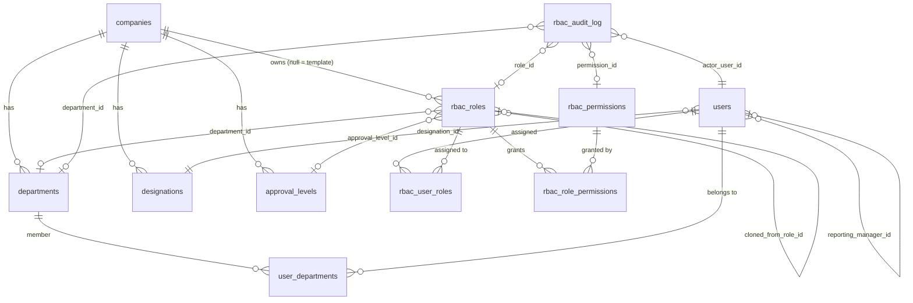

# RBAC Framework — Implementation Report

**Branch:** `feature/rbac-framework` (not merged into `main`, not deployed).
**Migration:** `migrations/0015_rbac_org_framework_up.sql` / `_down.sql`.

## 1. Scope and approach

This adds a fine-grained, per-company-configurable RBAC layer — departments,
designations, 21 role templates, a 15-module × 8-action permission matrix,
multi-role user assignment, and an immutable audit trail — **additively**,
alongside the existing frozen 4-role platform model
(`super_admin | company_admin | reviewer_qa | user`,
`pharmagpt/auth/decorators.py::require_role`, 42 existing call sites across
18 route files). That model, its RLS policies, `pharmagpt/auth/middleware.py`,
and every existing route's behavior are **unchanged**.

Two pieces of existing infrastructure were discovered during design and
reused rather than duplicated:
- `departments` / `user_departments` (migration `0014`) — reused as-is, with
  one additive `status` column and new write policies for `company_admin`
  (previously read-only, seed-script-populated only).
- `workflow_roles` (migration `0014`) — a fixed 5-row workflow-sequencing
  lookup consumed by the deviation workflow engine. **Not** the same thing
  as the new "Designation" concept (free-form, per-company job titles like
  "Production Executive") — conflating the two would have meant hardcoding
  designations into that frozen set. A new `designations` table was added
  instead; `workflow_roles` is untouched.

## 2. Role hierarchy (21 templates)

```
Platform           Platform Admin
Company            Company Admin, Plant Head
Quality (QA)       QA Manager, QA Officer
Quality Control    QC Manager, QC Analyst
Validation         Validation Manager, Validation Engineer
Production         Production Manager, Production Supervisor, Production Operator
Engineering        Engineering Manager, Maintenance Engineer
Warehouse          Warehouse Manager, Warehouse Executive
EHS                EHS Manager, EHS Officer
Regulatory Affairs Regulatory Manager
Read Only          Auditor, Viewer
```

These are `is_system=true` global templates (`rbac_roles.company_id IS NULL`)
seeded once by the migration. They are **not frozen**: a Company Admin can
clone, rename, disable, or build entirely custom roles from scratch. Every
new company is auto-provisioned a full copy of all 21 at creation time
(`pharmagpt/db/org_structure_repo.py::provision_org_defaults_for_company`,
called from `routes/companies.py::create_company`).

## 3. Department hierarchy (12 defaults, editable)

`Plant Head, Production, Quality Assurance (QA), Quality Control (QC),
Validation, Engineering, Warehouse, Environmental Health & Safety (EHS),
Regulatory Affairs, Human Resources, Finance, Information Technology`

Seeded per company via the existing `departments` table
(`org_directory.find_or_create_department`). Company Admin can add, rename,
or disable departments through the new UI (`/org/departments`). Role→
department association is a real foreign key (`rbac_roles.department_id`),
resolved once at clone time from a `department_code` hint — never a
hardcoded string check in application logic.

## 4. Permission matrix

15 modules × 8 actions = 120 permissions (`rbac_permissions`, static catalog):

**Modules:** Dashboard, Projects, Validation, Risk Assessment, Equipment
Library, Document Control, Knowledge Base, AI Assistant, Deviations, CAPA,
Change Control, QMS, Warehouse, Administration, Reports.

**Actions:** View, Create, Edit, Delete, Review, Approve, Export, Admin.

Default grants are seeded per role by tier (`pharmagpt/services/rbac_defaults.py`):

| Tier | Roles | Default grant shape |
|---|---|---|
| `platform_admin` | Platform Admin | Admin on Administration only; View on Dashboard. No tenant-module access. |
| `company_admin` | Company Admin | All 15 modules, all 8 actions. |
| `exec_oversight` | Plant Head | View+Export everywhere; Review+Approve on Deviations/CAPA/Change Control/QMS/Document Control/Validation/Risk Assessment. |
| `manager` | *Manager roles | View everywhere; Create/Edit/Review/Approve/Export on home + cross-cutting quality modules. |
| `officer` | *Officer/Analyst/Engineer/Executive roles | View everywhere; Create/Edit/Export on home modules; Create on Deviations/CAPA. |
| `operator` | Production Operator | View everywhere; Create on home modules + Deviations. |
| `auditor` | Auditor | View+Export everywhere. |
| `viewer` | Viewer | View everywhere. |

**Assumption, not Confirmed:** this is a reasonable operational starting
point, not a validated regulatory answer. Every grant is individually
toggle-able per role through the Permission Matrix UI
(`/rbac/roles/<id>/permissions`) — the customer's QA function should review
and adjust before relying on it in production.

## 5. ER diagram (new/changed tables)



## 6. Database changes

New tables: `designations`, `approval_levels`, `rbac_permissions`,
`rbac_roles`, `rbac_role_permissions`, `rbac_user_roles`, `rbac_audit_log`.

Additive columns: `departments.status`, `users.designation_id`,
`users.reporting_manager_id`.

New RLS write policies (company-scoped, `company_admin`-only) on
`departments` (previously read-only), `designations`, `rbac_roles`,
`rbac_role_permissions`, `rbac_user_roles`. `rbac_audit_log` has a
select-only policy and no client insert/update/delete grant at all —
immutability enforced at the grant level, matching `break_glass_access`'s
existing convention.

**Not applied to any live Supabase project from this session** — this
repo's convention (every prior migration, `0001`–`0014`) is SQL-editor-
applied by a human operator. The `.sql` files are ready to run the same way.

## 7. Central authorization layer

`pharmagpt/auth/rbac.py::has_permission(tenant, module, action)` /
`require_permission(module, action)` — independent of, and additive to,
`require_role()`. Used by the new `/rbac/*` and `/org/*` routes only; no
existing route was changed to use it (see §9, Remaining Recommendations).

- `super_admin`: `Administration`/`Admin` only, and only with no assumed
  company context — enforces "Platform Admin must NOT automatically access
  tenant GMP records."
- `company_admin`: unconditionally true — preserves this frozen tier's
  existing blanket authority everywhere else in the app; avoids a lockout
  for any company_admin with no `rbac_user_roles` row yet.
- Everyone else: resolved from the union of their assigned, active
  `rbac_user_roles`' granted permissions.

## 8. Files created / modified

**New:**
`migrations/0015_rbac_org_framework_up.sql`, `_down.sql`,
`pharmagpt/auth/rbac.py`, `pharmagpt/db/rbac_repo.py`,
`pharmagpt/db/org_structure_repo.py`, `pharmagpt/services/rbac_defaults.py`,
`pharmagpt/routes/rbac.py`, `pharmagpt/routes/org_structure.py`,
`pharmagpt/static/js/admin_org_structure.js`,
`pharmagpt/static/js/admin_roles.js`,
`tests/test_rbac.py`, `tests/test_org_structure.py`,
`docs/RBAC_FRAMEWORK.md` (this file).

**Edited (additive only):**
`pharmagpt/app.py` (register 2 new blueprints),
`pharmagpt/routes/companies.py` (`create_company` gains one additive call
to seed org defaults + assign the new admin their Company Admin role),
`pharmagpt/templates/index.html` (2 new nav items, 2 new admin views),
`pharmagpt/static/js/admin_assume_context.js` (nav visibility for the 2 new
items, same rule as the existing Users nav item),
`pharmagpt/static/js/header.js` (title-chip mapping for the 2 new views).

**Untouched:** `pharmagpt/auth/decorators.py`, `pharmagpt/auth/middleware.py`,
`pharmagpt/auth/context.py`, all 18 existing route files' `require_role`
call sites, `workflow_engine.py`, `workflow_roles`, `modules`/
`user_module_permissions`, `roles`/`users.role_id`.

## 9. Issue found and fixed during self-review

While reviewing `pharmagpt/routes/rbac.py` before committing, found that
role-targeted mutations (`PATCH /rbac/roles/<id>`, its permission-matrix
GET/PUT, and the clone source) took `role_id` from the URL without verifying
it belonged to the caller's allowed scope. For `company_admin` this is
caught by RLS (their client is RLS-scoped), but `super_admin` uses the
service-role client, which bypasses RLS entirely — so a Platform Admin with
no assumed company context could otherwise have mutated a tenant's role by
id, and `POST /rbac/users/<id>/roles` didn't verify the `role_id` being
assigned belonged to the caller's own company at all. Fixed with an explicit
app-level scope check (`_authorize_role_scope`/`_authorize_clone_source` in
`routes/rbac.py`, mirroring the same defense-in-depth discipline
`routes/users.py` already applies to its own service-role paths) before
this branch was committed. Covered by
`test_super_admin_without_assumed_context_cannot_update_another_companys_role`,
`test_company_admin_cannot_update_another_companys_role_by_id`, and
`test_company_admin_cannot_assign_another_companys_role_to_own_user` in
`tests/test_rbac.py`.

## 10. Remaining recommendations

- **Default permission matrix review**: the seeded grants (§4) are an
  operational baseline, not a QA-signed-off answer — review before
  production use.
- **`reviewer_qa`/`user` backfill**: existing users on those two frozen
  platform roles are not auto-mapped to one of the 21 new roles (no
  defensible 1:1 mapping exists) — Company Admin must assign roles manually
  post-migration via the User Assignment tab.
- **Incremental adoption of `require_permission`**: the 42 existing
  `require_role` call sites were deliberately left untouched in this phase.
  A follow-up phase could migrate specific high-value routes to the
  fine-grained `require_permission` gate where finer control is wanted,
  without touching the rest.
- **Approval levels are a placeholder**: `approval_levels` stores "Level
  1/2/3" only; no workflow logic reads it yet, per the task's explicit
  scope ("store levels only, no workflow implementation").
- **RLS write policies are new surface area**: `departments` previously had
  no `company_admin` write policy at all. Recommend a live RLS smoke test
  against a Supabase staging project before this migration reaches
  production, in addition to the mocked-client test coverage in this branch.
